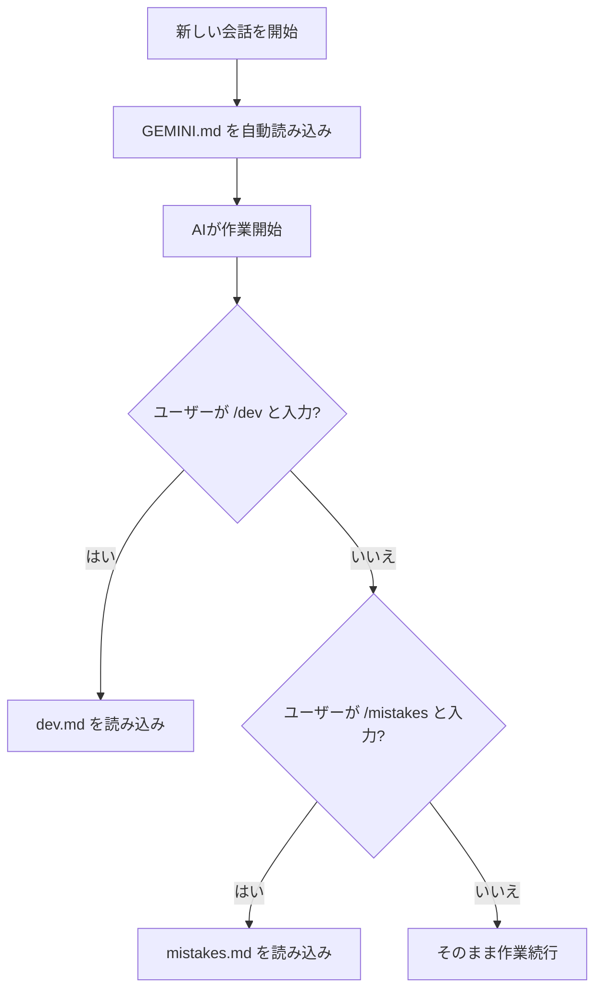

# 🤖 AIアシスタントのルール設定ガイド

> penプロジェクトでAIの動き方をコントロールする仕組みの説明書です。

---

## そもそも何ができるの？

AIアシスタント（Gemini / Antigravity）に **「こういうルールで働いてね」** と伝える設定ファイルがあります。

これを正しく書いておくと、**毎回同じ説明をしなくても、AIが自動的にルールを守って働いてくれます。**

---

## 🚀 ゼロからセットアップする手順

### 前提条件

- **VS Code** がインストールされていること
- **Gemini Code Assist（またはAntigravity）** の拡張機能がインストールされていること
- プロジェクトフォルダが VS Code で開かれていること

### Step 1: `GEMINI.md` を作る（5分）

1. VS Code でプロジェクトのルートフォルダ（一番上の階層）を開く
2. ルートフォルダに **新しいファイル** を作成する
3. ファイル名を **`GEMINI.md`** にする（大文字！）
4. 中身をマークダウン記法で書く

```
pen/
├── src/
├── package.json
└── GEMINI.md    ← ★ ここに作る！
```

**中身の書き方（テンプレート）**:

```markdown
# プロジェクト名 - プロジェクトルール

## 技術スタック

- **フレームワーク**: Next.js 16
- **データベース**: Supabase
- **スタイリング**: Tailwind CSS v4

## コーディング規約

- 日本語UIを優先
- Server Actions は必ず try-catch で囲む

## 作業スタイル

1. 曖昧な指示は仮説付きで確認する
2. 報告は日本語
```

5. **保存する**（Ctrl + S）
6. これだけで完了！次にAIと会話を始めたとき、自動的にこのファイルが読まれます

> [!TIP]
> `GEMINI.md` に書く内容は自由です。AIに守ってほしいルールを、箇条書きで書けばOK。

---

### Step 2: ワークフローを作る（10分）

1. プロジェクトのルートに **`.agent`** フォルダを作る（先頭にドット！）
2. その中に **`workflows`** フォルダを作る

```
pen/
├── .agent/
│   └── workflows/
│       ├── dev.md         ← 開発手順書
│       └── mistakes.md    ← やっちゃダメリスト
├── src/
└── GEMINI.md
```

3. `workflows` フォルダの中に `.md` ファイルを作成する

**重要**: 各ワークフローファイルの **先頭3行** に、以下のようなヘッダーを書く必要があります:

```markdown
---
description: このワークフローの説明（一行で）
---
```

**例: `dev.md` の書き方**:

```markdown
---
description: 標準的な開発ワークフロー（ビルド、テスト、デプロイ）
---

# 開発ワークフロー

## ローカル開発

1. 依存関係のインストール

`npm install`

2. 開発サーバー起動

`npm run dev`
```

**例: `mistakes.md` の書き方**:

```markdown
---
description: 繰り返しミスの再発防止チェックリスト
---

# ⛔ 再発防止ルール

## 1. PowerShell コマンド

- `&&` は絶対に使わない → `;` で連結する
```

4. **保存する**
5. ワークフローは `/dev` や `/mistakes` のように **スラッシュ＋ファイル名** でAIに呼び出させることができます

> [!NOTE]
> ファイル名がそのまま呼び出しコマンド名になります。
> `dev.md` → `/dev` で呼び出し
> `mistakes.md` → `/mistakes` で呼び出し
> 好きなワークフローをいくつでも追加できます。

---

### Step 3: 動作確認（2分）

1. VS Code で **新しい会話** を開始する（古い会話では反映されないことがある）
2. AIに「GEMINI.mdの内容を教えて」と聞いてみる
3. ルールが返ってくれば成功！

---

### よくある失敗と対処法

| 失敗                        | 原因                                   | 対処法                               |
| --------------------------- | -------------------------------------- | ------------------------------------ |
| AIがルールを無視する        | 古い会話を使い続けている               | **新しい会話** を開始する            |
| ワークフローが認識されない  | ヘッダー（`---` で囲まれた部分）がない | 先頭3行に `description` を追加       |
| ファイルが見つからない      | ファイル名を間違えている               | `GEMINI.md`（大文字）かチェック      |
| `.agent` フォルダが見えない | OSが隠しファイルを非表示にしている     | VS Code のエクスプローラーでは見える |

---

## 📁 設定ファイルは3つある

```
pen/
├── GEMINI.md                       ← ① プロジェクトルール
├── .agent/workflows/dev.md         ← ② 開発の手順書
└── .agent/workflows/mistakes.md    ← ③ やっちゃダメリスト
```

### ① `GEMINI.md` — プロジェクトルール（一番大事）

**役割**: AIがこのプロジェクトで作業するときの「憲法」のようなもの

- 新しい会話を始めるたびに、AIは **最初にこのファイルを自動で読みます**
- つまり、ここに書いたルールは **毎回必ず適用されます**
- 手動で読み込ませる必要はありません

**書いてある内容の例**:

| 項目             | 内容                                       |
| ---------------- | ------------------------------------------ |
| 技術スタック     | Next.js, Supabase, Tailwind CSS など       |
| コーディング規約 | `@/` エイリアスを使う、try-catch 必須 など |
| コミット規約     | `feat:` `fix:` などのプレフィックス        |
| 作業スタイル     | 曖昧な指示は確認する、勝手に方針を変えない |

**設定方法**: プロジェクトのルートフォルダに `GEMINI.md` というファイル名で置くだけ。

---

### ② `.agent/workflows/dev.md` — 開発の手順書

**役割**: 「ビルドってどうやるの？」「デプロイの手順は？」をまとめたマニュアル

- ユーザーが `/dev` と打つと、AIがこの手順書を読んで実行します
- 普段の会話では自動で読み込まれませんが、ワークフロー一覧としてAIに認識されています

**書いてある内容の例**:

- `npm install` → `npm run dev` の流れ
- ビルド＆デプロイの手順
- Supabase マイグレーションの手順

---

### ③ `.agent/workflows/mistakes.md` — やっちゃダメリスト

**役割**: AIが過去に2回以上やらかしたミスの再発防止チェックリスト

- ユーザーが `/mistakes` と打つと、AIがこのファイルを読みます
- `dev.md` からも参照されているので、`/dev` を使ったときも間接的に見えます

**書いてある内容の例**:

- PowerShellで `&&` を使わない（`;` を使う）
- 使わなくなったimportを消し忘れない
- `'use client'` を書き忘れない

---

## 🔄 それぞれの読み込みタイミング



| ファイル      | いつ読まれる？         | 自動？手動？ |
| ------------- | ---------------------- | ------------ |
| `GEMINI.md`   | 毎回の会話開始時       | ✅ 自動      |
| `dev.md`      | `/dev` コマンド時      | 🖐️ 手動      |
| `mistakes.md` | `/mistakes` コマンド時 | 🖐️ 手動      |

---

## ✏️ ルールを変えたいときは？

### もしAIの動き方を変えたい場合

1. 該当するファイルを **テキストエディタで開く**
2. マークダウン記法で **ルールを編集する**
3. **保存する**（それだけでOK）

### 例: 「コミットメッセージを英語にしたい」

`GEMINI.md` のコミット規約の部分を書き換えるだけ:

```diff
  ## コミット規約
- - `feat:` 新機能
+ - `feat:` New feature
```

### 例: 「AIがよくやるミスを追加したい」

`.agent/workflows/mistakes.md` にチェックリスト項目を追加:

```diff
  ## 3. Next.js / React
+ - [ ] `key` propをリストのmapに必ずつける
```

---

## 💡 まとめ

| やりたいこと                   | どこを編集する？               |
| ------------------------------ | ------------------------------ |
| AIの基本ルールを変えたい       | `GEMINI.md`                    |
| 開発手順を変えたい             | `.agent/workflows/dev.md`      |
| AIのミス防止ルールを追加したい | `.agent/workflows/mistakes.md` |

**一番覚えておくべきこと**: `GEMINI.md` に書いたことは **毎回自動で読まれる**。だから、AIに絶対守ってほしいことはここに書く。
